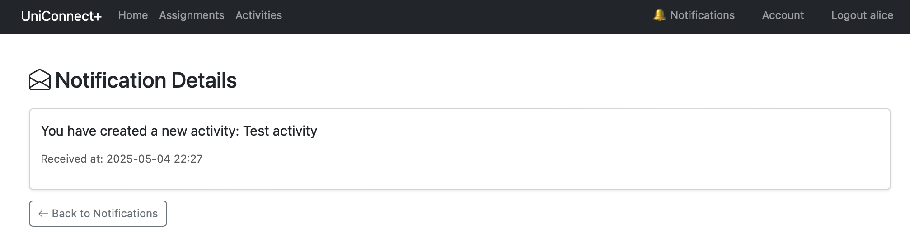
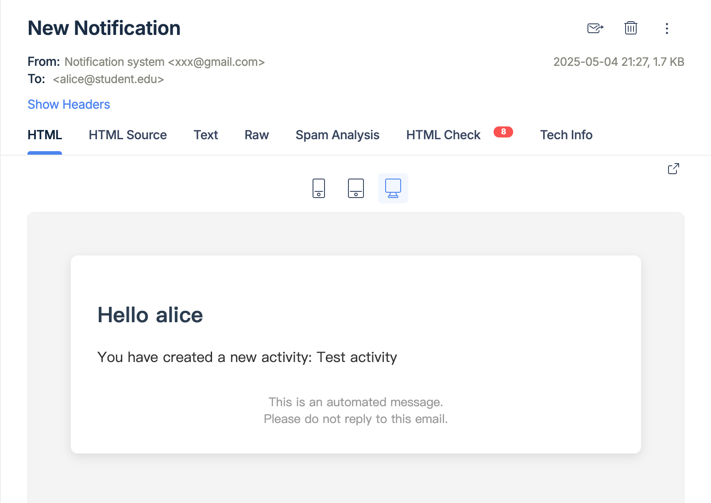

# Uniconnect-Student Activity and Assignment Notification System
Uniconnect is a Flask-based web application designed for students and instructors to manage activities and assignments with real-time notifications and email alerts.

## 1. Main Features

- User registration / login / logout
- Role management (Student / Professor)
- Activity creation, participation, leave (with full capacity alerts & reminders)
- Assignment submission and deadline reminders
- Notification system (read / unread support)
- Email notifications via Mailtrap
- Daily scheduler for 3-day prior activity reminders

## 2. Screenshots

## 3. Background scheduler will auto-run and send daily reminders 
*(use interval=minutes=1 for testing)

### Email Setup

Using [Mailtrap](https://mailtrap.io/) to simulate email delivery.

In your config.py:

MAIL_SERVER = 'sandbox.smtp.mailtrap.io'  
MAIL_PORT = 587  
MAIL_USE_TLS = True  
MAIL_USE_SSL = False  
MAIL_USERNAME = '<your Mailtrap username>'  
MAIL_PASSWORD = '<your Mailtrap password>'  
MAIL_DEFAULT_SENDER = ('Notification system', 'xxx@gmail.com')

## 4. Testing

### Positive Tests:
#### Automatic Activity Reminder (Notification + Email)

Scenario:
- An activity is scheduled to start exactly 3 days from today. When the daily scheduler runs, the system automatically sends a reminder to both the activity creator and all participants.

Expected Result:
- All users receive an in-system notification like:  
  "Reminder: The activity 'AI Study Group' will start at 2025-05-07 15:30."
- All users receive an HTML email with the same content
- Notifications are marked as unread

Why it matters:
- Demonstrates automated background scheduling
- Shows multi-recipient notifications triggered dynamically
- Combines time logic + email + UI + database updates

### Negative Test:
#### Unauthenticated User Accesses Notification Pages

Scenario:
- A user who is not logged in tries to access /notifications directly via URL.

Expected Result:
- The system should redirect the user to the login page.
- No notifications should be shown.
- No new Notification records or emails should be generated.

Why it matters:
- Confirms that access control and @login_required are properly implemented.
- Prevents unauthorized viewing of private notifications.
- Demonstrates the notification system includes security and access safety checks.

## 5. System Notifications and Email Alerts:
- Each important user action triggers a system notification and email.
- Notifications are stored in the database and displayed in a dedicated Notifications page.

#### Trigger Events:
1. Creating an Activity  
   - After a student creates an activity, the system shows a notification and sends an email to the creator.

2. Joining an Activity  
   - When a student joins an activity, they receive a notification and email confirming their participation.

3. Submitting an Assignment  
   - Students receive confirmation notifications and emails upon submitting an assignment.

4. Activity Reaches Full Capacity (5 students)  
   - The activity creator gets a notification and email when the activity reaches 5 participants.

5. 3-Day Reminder  
   - Three days before an activity’s scheduled date, the system automatically sends reminders to both the creator and all participants via notification and email.

6. Feedback Given  
   - When a professor gives feedback on an assignment, the student receives a system notification and an email.

#### Notification Page:
- Students and professors can view all notifications from the navbar "🔔 Notifications".
- Unread notifications are highlighted.
- Clicking on a notification redirects to a detail page and automatically marks it as read.
- Navbar also displays the number of unread messages.

#### Email Notification:
- Emails are sent through Mailtrap using Flask-Mail.
- All notification messages are sent as both plain text and styled HTML using a custom template.
- If HTML email fails to render, the system falls back to plain text email to avoid failure.

#### Scheduler:
- APScheduler runs a daily job that automatically checks for activities starting in 3 days.
- Sends reminders to all related users.
- In development, it can be switched to run every minute for testing.

#### Security:
- Notifications pages are protected with @login_required.
- If a user tries to access notifications without logging in, they are redirected to the login page.

#### Testing Tools:
- Notification logic is separated via trigger_notification() for easy extension and testing.